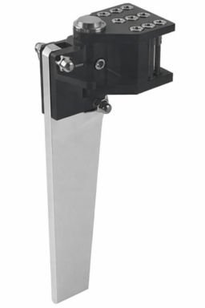
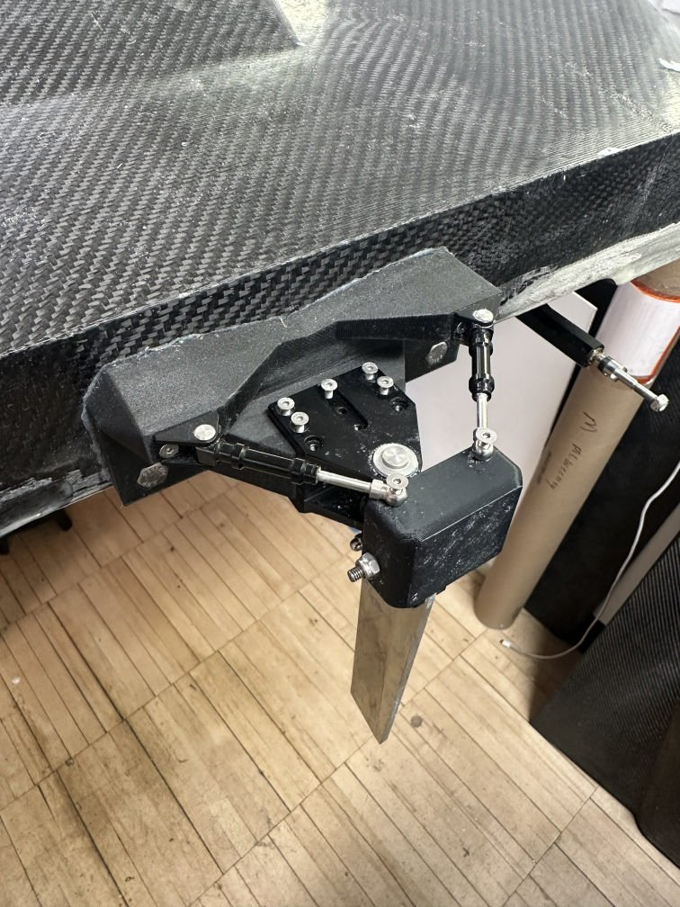
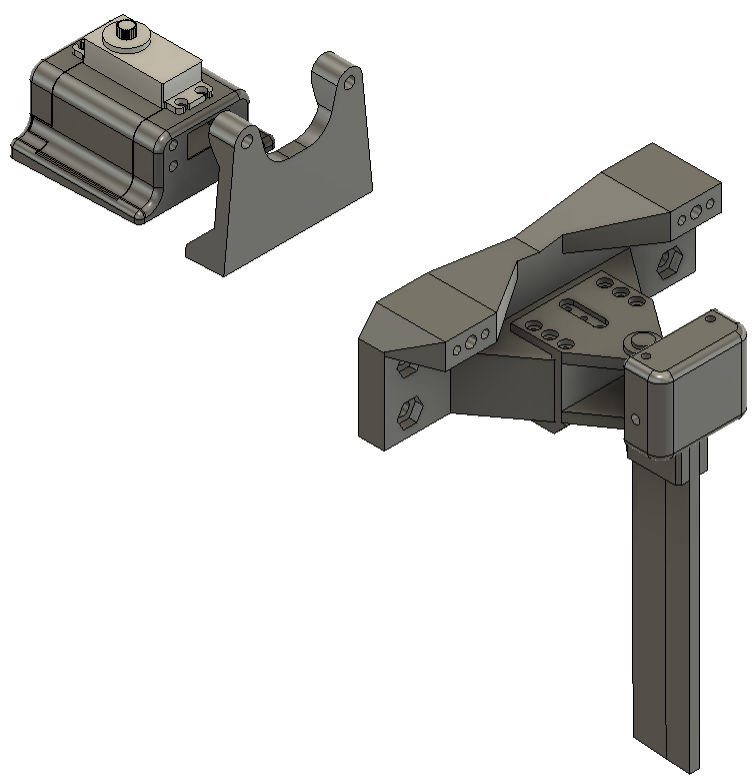
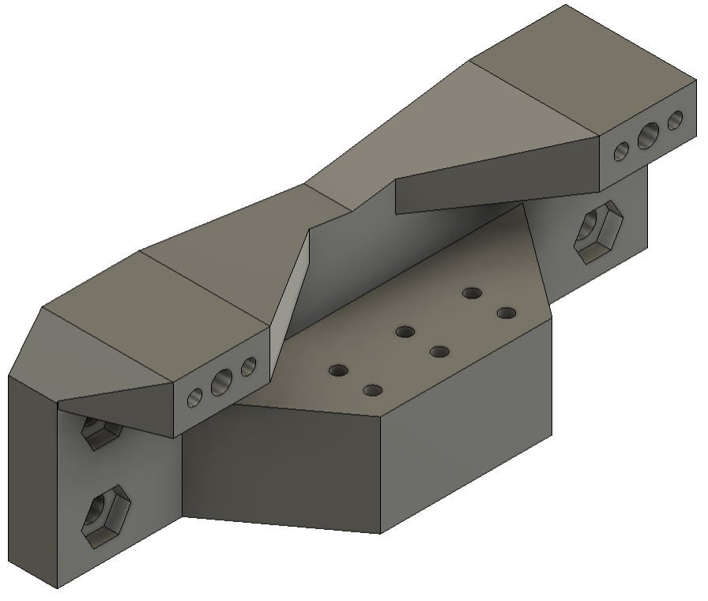
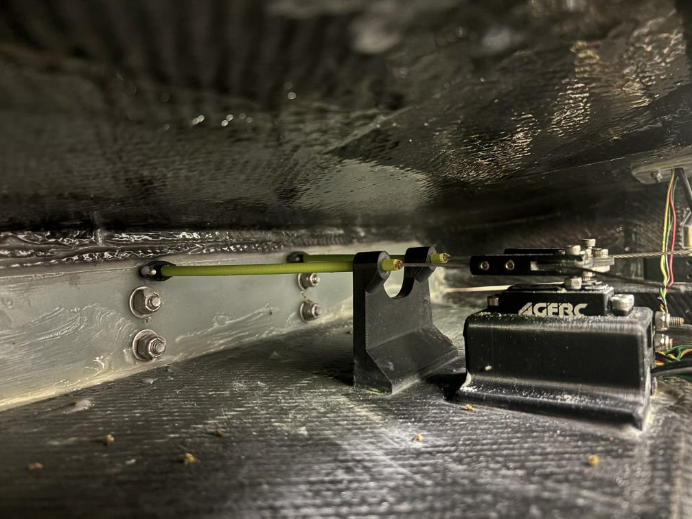

# Osprey — Engineering Constraints

**What this is.** The boundaries any Osprey design decision has to sit inside,
each with its source and the consequence of crossing it. Rules, physics, the
hardware already on the boat, and the geometry of the hull. The rudder section
at the end works the constraints through to a spec, as the worked example.

**Sources.** `[R]` the PEP26 Autonomy Division rules · `[T §x]` the Astudillo
& Lee thesis, the as-built record · `[SIM]` the simulation in this repo ·
`[TEAM]` stated by the current team. Anything unverified says so.

---

## 1. Competition constraints `[R]`

Hard limits. A craft outside any of these does not race.

| ID | Constraint | Value | Osprey | Consequence |
|---|---|---|---|---|
| C1 | Battery total voltage | ≤ 55.5 V | 44.4 V nominal, 50.4 V full | Fixes the bus. Nothing higher is legal. |
| C2 | Battery capacity | < 500 Ah | 20.8 Ah | Not binding |
| C3 | Payload | 30 lb, removable, weighed dockside | 13.6 kg in the model | Part of the loaded mass everything is sized to |
| C4 | Race distance | 2 statute miles | — | Sets energy and thermal duration |
| C5 | Heat window | 55 min | Sim finishes in ~7 min | Not binding on speed |
| C6 | Kill on navigation loss | Must engage when GPS is missing or corrupted, demonstrated to judges | **Not implemented** | A required autonomy feature, not optional |
| C7 | Positive buoyancy | Must float fully flooded | Verify | Constrains hull volume budget |
| C8 | Tow bridle | Across both hulls, boat-hook reachable | Verify | |
| C9 | Main disconnect + fuse | All propulsion current through one disconnect; fuse for 24–55 V | Present per thesis | |
| C10 | Launch | Ramp to open water in 5 min | — | Constrains startup sequence and pre-arm checks |
| C11 | No pre-built motor or kit | Motor, ESC, shaft, prop assembled by the team | Compliant | |

**Scoring shapes priorities.** 10 pts per completed half-mile (40 total) against
20 / 16 / 12 / 8 / 4 for placing. **Finishing is worth twice winning.** The
required average speed to finish inside the heat is under 1 m/s. `[R]`

---

## 2. Physical limits — where the models stop applying

These are not design choices. They are places the physics changes regime.

| ID | Constraint | Value | Source | Consequence |
|---|---|---|---|---|
| P1 | **Rudder cavitation ceiling** | σ < 0.5 above **19.8 m/s (44 mph)**; σ = 0.15 at 80 mph | `[SIM]` | Attached-flow rudder model is void above ~44 mph. Anything above that is extrapolation. A conventional blade at 70–80 mph needs a ventilated or supercavitating section, not a bigger one. |
| P2 | **Ventilation onset** | ~10° deflection (swept 6–15°), latched, re-wets below ~6° | `[SIM]` | Yaw moment **falls** past onset (64 → 39 N·m at 30 mph). Useful deflection is ~10°, not the 35° the linkage reaches. |
| P3 | **Hull regime change** | Displacement → planing over ~6–10 m/s; wetted area collapses 12× | `[SIM]` | Hull damping and rudder authority both change character. One gain set cannot span it. |
| P4 | **Manoeuvring-coefficient validity** | Standard regressions fitted at Fn < 0.3; Osprey runs Fn 2.9–7.8 | `[SIM]` | Hull derivatives are unknown to ±5×. Every conclusion must survive that. |
| P5 | **Turn radius is speed-independent** | R depends on deflection, not speed (u² authority ÷ u damping ÷ u required rate) | `[SIM]` | High speed never sizes the rudder. Low speed plus disturbance does. |
| P6 | **Speed sag in a hard turn** | 14–34% at full rudder | `[SIM]` | Gain schedule chases a moving operating point mid-turn. Limit commanded yaw rate. |

---

## 3. Hardware constraints — what is already on the boat

| ID | Item | Limit | Where the boat sits | Source |
|---|---|---|---|---|
| H1 | **ESC** Hydra Cobra 5 HV | 180 A continuous, 9 kW at 50.4 V; requires **50 C** packs | 45 A at 30 mph (25%). 80 mph needs 180 A (100%) | `[T §3.2]` `[SIM]` |
| H2 | **Motor** Castle 2535 680Kv | 23,150 rpm logged | Under-loaded: 45 A where 100 was expected | `[T §6]` |
| H3 | **Battery** 8 × Lectron Pro 22.2 V 5200 mAh 100 C, 2S-2P per ESC | 100 C discharge; 924 Wh total | 17 C at 80 mph. Energy is **not** a constraint at any speed (54% of usable for 2 mi at 80 mph) | `[T §6.2]` `[SIM]` |
| H4 | **Steering servo** AGFRC A81FHM HV | **74 kg·cm** stall at 8.4 V | See §5 — depends entirely on the rudder stock position | `[T §3.4.1]` |
| H5 | **Cooling** | Motor/ESC limit 82 °C | Sits at 40 °C — but raw-water side has never flowed and the boat has never run a race duration | `[T §7.2]` |
| H6 | **Driveline** | Flex shaft retained by collet clamping force only | Failed at PEP26 by collet wear | `[T §6.2]` |
| H7 | **Prop** Graupner 76 mm | Zero-thrust advance ratio unknown | J0 ≥ 1.22 needed for 80 mph to be reachable at all | `[SIM]` |

**Two derived constraints that follow:**

- **H1 and H5 are the same constraint.** 180 A continuous assumes the cooling
  works. It does not. Nothing near the ESC rating is available until raw-water
  flow is proven.
- **H2 bounds speed, not H1.** The boat draws a quarter of what the ESC can
  supply. The limit on speed today is the propeller's loading of the motor. A
  larger ESC changes nothing.

---

## 4. Geometric constraints `[T §3]`

| ID | Constraint | Value |
|---|---|---|
| G1 | Length overall | 7 ft 0 in (2.134 m) |
| G2 | Deck beam / tunnel width | 30.5 in / 18.0 in |
| G3 | Loaded mass | 97.4 lb (44.2 kg) with payload; 67.4 lb dry |
| G4 | CG | ~30% LOA forward of transom; battery rails slide 25–35% |
| G5 | Prop lateral separation | ~0.598 m (`y_p` = 0.299 m) — **verify from CAD** |
| G6 | **Rudder mount cannot sit below the bottom of the transom** | "at high speeds it would cause too much drag, and at low speeds the mount would be dragging through the water" `[T §3.4.2]` |
| G7 | Rudder mounts "as low as possible" within G6 | The previous team's own concern was insufficient blade engagement `[T §3.4.2]` |
| G8 | Rudder block sits atop the blade to meet the cable height | Longer blade extends **down**; the block and cable geometry stay `[T §3.4.2]` |

---

## 5. Rudder — constraints worked through to a spec

### 5.1 What is on the boat

MHZ Mystic C5000 rudder, chosen because it is made for the same catamaran at a
similar scale `[T §3.4.1]`. Blade 150 mm × 30 mm. The thesis's own sizing assumed
**"submerged blade area of 50% of 150 mm by 30 mm"** — i.e. about 3 in in the
water — and the team's current estimate agrees `[TEAM]`. Still an estimate; a
photograph of the transom on plane would settle it.

The mount was designed to put the blade as low as G6 allows. The previous team
wrote that *"there were concerns that the rudder we had was not long enough to
get enough engagement with the water"* `[T §3.4.2]`. More depth was already on
their list.

### 5.2 The constraints that shape the rudder

| ID | Constraint | Why |
|---|---|---|
| R1 | **Size on span, not area** | Authority is `A_r · CL_α`. Growing area at fixed span grows the chord, which collapses aspect ratio and cancels the gain: **30× the area buys 32%**; growing span instead buys 5× for a third of the area. `[SIM]` |
| R2 | **Chord stays at 30 mm** | Follows from R1. Widening it is the one thing that does not help. |
| R3 | **Useful deflection is ~10°** (P2) | The allocator clamps there. Authority past onset is not real. |
| R4 | **Stock at 20–25% chord aft of the leading edge** | Hinge moment is `F · (x_cp − x_stock) · c`. At the CoP it is near zero; at the leading edge the lever is 0.25 c. This decides whether H4 is adequate — see 5.4. |
| R5 | **Mount stays put; blade extends downward** (G6–G8) | The block-and-cable geometry at the top of the blade is unchanged. |
| R6 | **Same thin section, no end plate** | A fatter section ventilates earlier on a surface-piercing blade. An end plate does nothing once the blade ventilates. |

### 5.3 The spec — 3 in + 2 in `[TEAM]`

| | current | **new** |
|---|---|---|
| Submerged span | 3.0 in / 76 mm | **5.0 in / 127 mm** |
| Chord | 1.18 in / 30 mm | **1.18 in / 30 mm** |
| Wetted area | 3.5 in² | **5.9 in²** |
| Aspect ratio | 2.5 | **4.2** |
| Total blade length | 5.9 in | **~8 in** (same mount, 2 in longer below) |
| Stock position | unknown — **measure** | **20–25% chord aft of LE** |
| **Max mechanical deflection** | ±35° **assumed** — not stated in the thesis; set by the pull-pull horn and mount tabs. **Measure on the boat.** | same linkage, same stop |
| **Max useful deflection** | ±10° — ventilation onset (P2) | **±10°. Limit the autopilot here, not at the stop.** Past onset the blade gives *less* moment, not more. |
| **Servo** | AGFRC A81FHM HV, **74 kg·cm stall at 8.4 V**, BEC-fed from one ESC `[T §3.4.1]` | **Same servo is sufficient** provided the stock is at 20–25% c — see 5.4. At a leading-edge stock it is exceeded above ~55 mph. |
| Authority `A_r·CL_α` | 1.0× | **2.2×** |
| Steady turn radius, full useful rudder | ~20 m (9.5 LOA) | **~11.5 m (5.4 LOA)** |
| Rudder drag at 10 m/s, full deflection | 2.5% of hull | ~4% of hull |

**Why 10° and not 35°.** The linkage can reach 35°, but the blade ventilates at
about 10° and the yaw moment then *falls* — 64 N·m at 10° to 39 N·m at 12° at
30 mph, latched until the blade unloads below ~6° `[SIM]`. Commanding past onset
hands the controller a negative plant gain. The autopilot's steering output
should be scaled so that full stick is ±10°; the remaining travel is reserve for
a manual recovery, not something the loop should ever see.

Going from aspect ratio 2.5 to 4.2 is the steepest part of the lift-slope
curve, which is why 2 in of span buys 2.2× rather than the 1.7× the area ratio
alone would suggest.

**What the course asks for.** Holding the 128 m oval needs under 2° of steady
rudder at any speed `[SIM]`. The new blade is not for turning. It is for
disturbance-rejection margin: across the ±5× parameter uncertainty the current
blade spends 41% of a lap pinned at its useful limit; a blade in this class
does not saturate `[SIM]`.

### 5.4 Servo check against H4

Peak hinge moment occurs **at ventilation onset (~10°)**, where lift is highest,
not at full deflection. For the 5 in blade against the 74 kg·cm servo:

| speed | stock at LE | stock at 15% c | **stock at 20–25% c** |
|---|---|---|---|
| 30 mph | 20 kg·cm (27%) | 8 (11%) | ~0 |
| 45 mph | 45 (60%) | 18 (24%) | ~0 |
| 70 mph* | **109 (148%)** | 44 (59%) | ~0 |

*\*Beyond P1. Direction is certain, magnitude ±30%.*

**A leading-edge stock overloads the servo at 70 mph. Balanced at 20–25% chord,
the existing servo covers every speed.** R4 is therefore a hard constraint of
this spec, not a preference. Ask the previous team where the current blade's
stock sits before copying it.

### 5.5 Reconciling the thesis's 66 kg·cm

The thesis sized the servo as `F = ½ρV²·A·C_D` with C_D = 0.3 at 80 mph,
giving 436 N, then multiplied by the **1.5 cm servo horn arm** to get
66 kg·cm `[T §3.4.1]`. That lever is the force-to-torque conversion *at the
servo*, not the hinge moment *at the stock*. The correct lever is
`(x_cp − x_stock) · c`, which for a balanced blade is near zero and for a
leading-edge stock is 7.5 mm.

Re-run correctly at their own 80 mph condition: **45 kg·cm** worst case (LE
stock), ~0 balanced `[SIM]`. Their figure was conservative by about 46% — which
is why the 74 kg·cm servo has been adequate — and it would have stayed adequate
at the leading edge only because the boat never went faster than 30 mph.

### 5.6 What is still open on the rudder

| | Unknown | Closes by |
|---|---|---|
| U1 | Actual submerged depth on plane | One photo of the transom at 30 mph |
| U2 | Current stock position on the blade | Callipers, or ask Monday (A2) |
| U3 | Tiller arm radius — scales servo torque linearly | Callipers, or ask Monday (A3) |
| U4 | Ventilation onset angle for this blade | Turn circles at 5° / 10° / 15° / 20° |
| U5 | Draft on the trailer and at the ramp with a blade 2 in longer | Measure before the first launch |
| U6 | **Mechanical deflection limit of the linkage** — the 35° in the model is assumed | Swing the rudder stop-to-stop with a protractor. Ten seconds. |

---

## 6. Constraints that are still undefined

Things that will constrain the design once known, and currently do not because
nobody has the number.

| ID | Unknown | What it will constrain |
|---|---|---|
| X1 | **Speed target** — 30, 50, 70 or 80 mph | ESC choice, wiring, cooling load, prop, and whether P1 matters. **The decision to force first.** |
| X2 | Yaw inertia `Izz` | Turn response; largest single unknown in the model (±50%). Bifilar pendulum, one hour. |
| X3 | Hull derivatives | Everything in the control design. On-water zig-zags. |
| X4 | Prop `KT(J)` | Whether any speed above ~26 m/s is reachable at all (H7). |
| X5 | Course mark spacing vs lap length | Marks 0.25 mi apart put 0.5 mi of straight in a lap before turning; a lap cannot also be 0.5 mi. One of the two numbers is nominal. |
| X6 | Steering allocation architecture | ArduPilot drives a rudder *or* twin motors, not both. Decide before tuning. |
