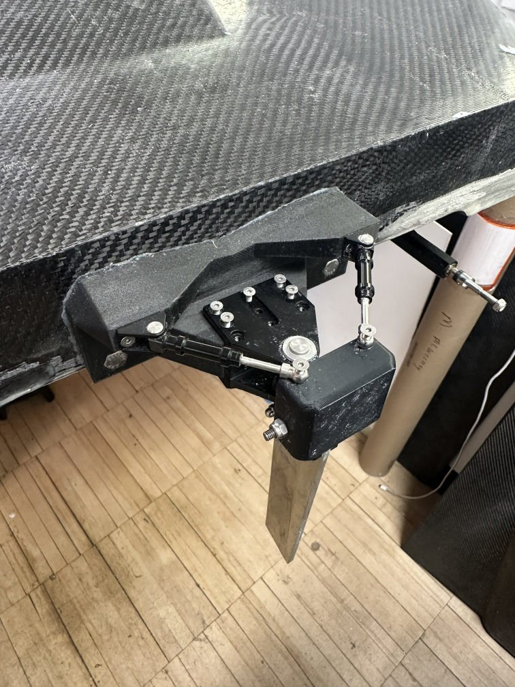

# Osprey Rudder — Engineering Constraints

`[T]` thesis · `[SIM]` simulation (`python -m osprey size`) · `[TEAM]` team decision · **bold** = unverified

**Existing rudder.** MHZ Mystic C5000, 150 × 30 mm blade, about **3 in (76 mm)
submerged** on plane (unmeasured). Mount is as low as the transom allows `[T §3.4.2]`.
AGFRC A81FHM HV servo, **74 kg·cm stall at 8.4 V**, pull-pull cables `[T §3.4.1]`.
**Race plan:** 50 mph cruise `[TEAM]`.

## Constraints

| # | Constraint | Reason |
|---|---|---|
| R1 | **Span buys authority; chord mostly buys drag and hinge moment** | Authority is `A_r·CL_α`. At 5 in span, going 30 → 45 mm chord adds 23% authority for +50% area, +51% drag and 1.8× the hinge moment. `[SIM]` |
| R2 | **Useful deflection ±10°** — autopilot clamps here, not at the stop | Blade ventilates near 10°; moment then drops ~40% and stays down until ~6°. `[SIM]` |
| R3 | **Mechanical stop ±35° — assumed** | Set by horn and mount tabs. Measure. |
| R4 | **Stock at 20–25% chord aft of LE** | Hinge moment is `F·(x_cp − x_stock)·c`. At 45 mm chord this decides whether the servo works at all (below). |
| R5 | **Mount stays; blade extends 2 in downward** | Mount cannot go below the transom `[T §3.4.2]`. Block and cables unchanged. |
| R6 | **Model valid to 44 mph** | Cavitation number < 0.5 above 19.9 m/s. The 50 mph race is past this: extrapolated. `[SIM]` |
| R7 | **Autopilot steers with motors below 10 mph, rudder only above** `[TEAM]` | Rudder authority goes as U²; at launch it has almost none. |

## Spec — 45 mm × 5 in `[TEAM]`

| | current | **new** | | current | **new** |
|---|---|---|---|---|---|
| Submerged span | 3.0 in / 76 mm | **5.0 in / 127 mm** | Total blade, same mount | 5.9 in | **7.9 in** |
| Chord | 30 mm | **45 mm** | Stock position | **unknown** | **20–25% c** |
| Wetted area | 3.5 in² | **8.9 in²** | Authority `A_r·CL_α` | 1.0× | **2.7×** |
| Aspect ratio | 2.5 | **2.8** | Turn radius at 10°, 5 m/s | 28 m (13.3 LOA) | **19 m (8.9 LOA)** |
| Drag at 10°, 10 m/s | 4.3% of hull | **11.0%** | Peak rudder, 50 mph race | 7.9° | **6.5°** |

## Servo check, new blade — 74 kg·cm stall

| speed | stock at LE | 25% c, CoP 0.10c off | 25% c, CoP nominal |
|---|---|---|---|
| 30 mph | 37 / 47 kg·cm | 15 / 19 | ~0 |
| **50 mph** † | **103 / 132** | **41 / 53** | ~0 |
| 70 mph † | 202 / 258 | 81 / 103 | ~0 |

Worst case from straight running: travel clamped at 10° / full travel to 35°. With
full travel the peak is *past* ventilation onset (~26°), not at it. † past R6.
In the simulated 50 mph race the autopilot needed **under 10 kg·cm**; the table is
the step-input worst case. **Verdict: the servo is adequate at 50 mph only with the
stock near 25% chord.** With an LE stock, use a 2:1 tiller arm or a stronger servo.

The thesis's 66.8 kg·cm (drag × horn radius, 80 mph) is *not* conservative: the
correct hinge moment for the old blade with an LE stock is 65 clamped / 83 full
travel `[SIM]`. It lands close by coincidence.

**Measure before building:** submerged depth on plane · stock position · tiller arm
radius · mechanical stop · trailer and ramp draft with 2 in more blade.
