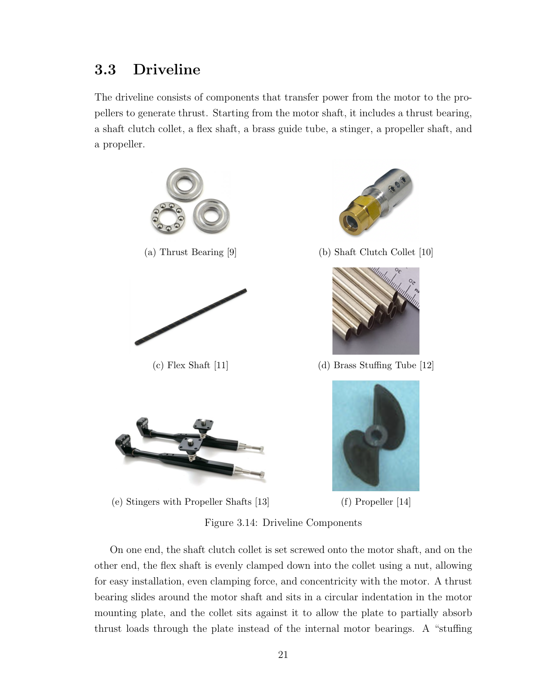
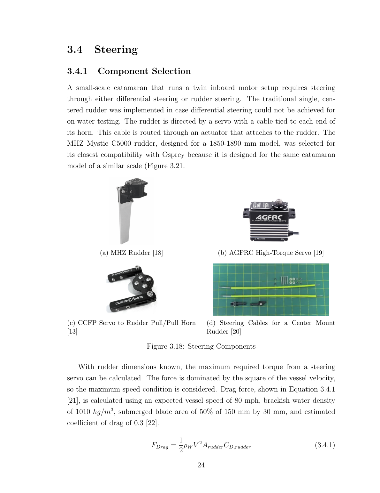
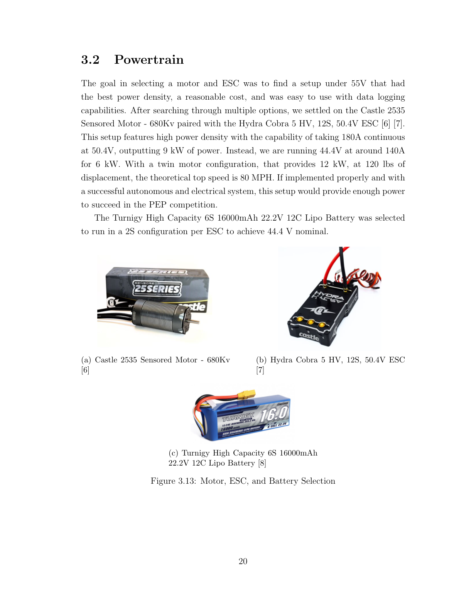
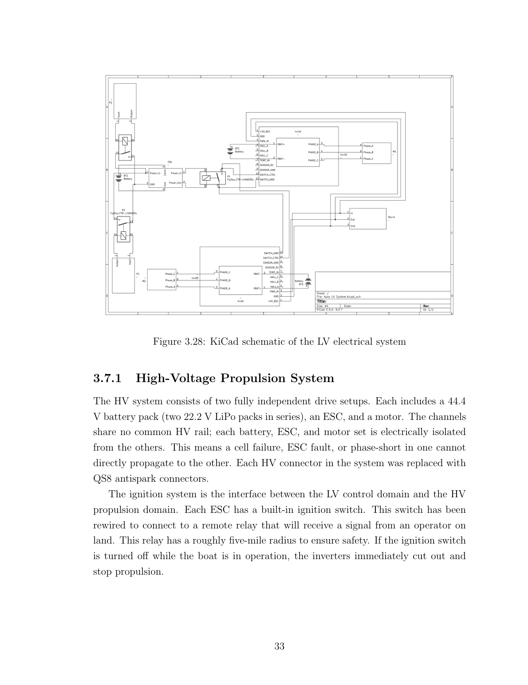
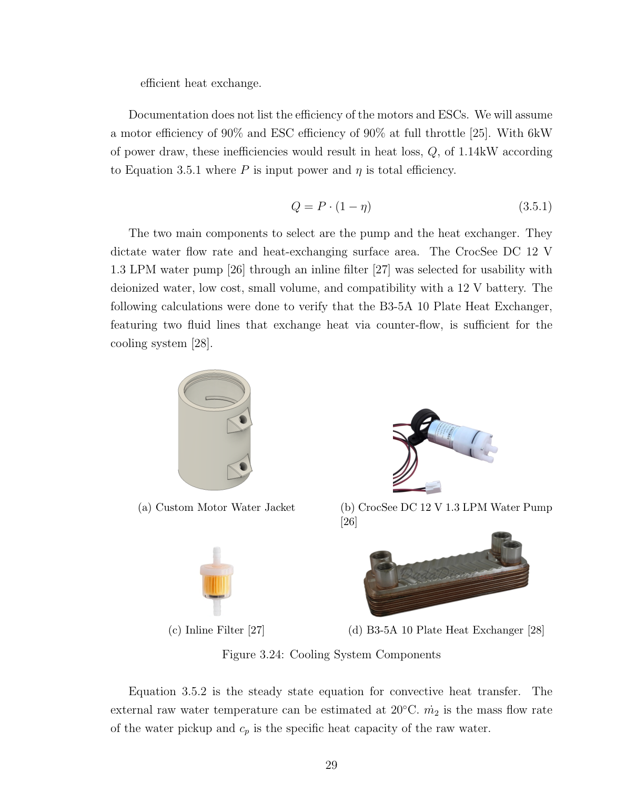
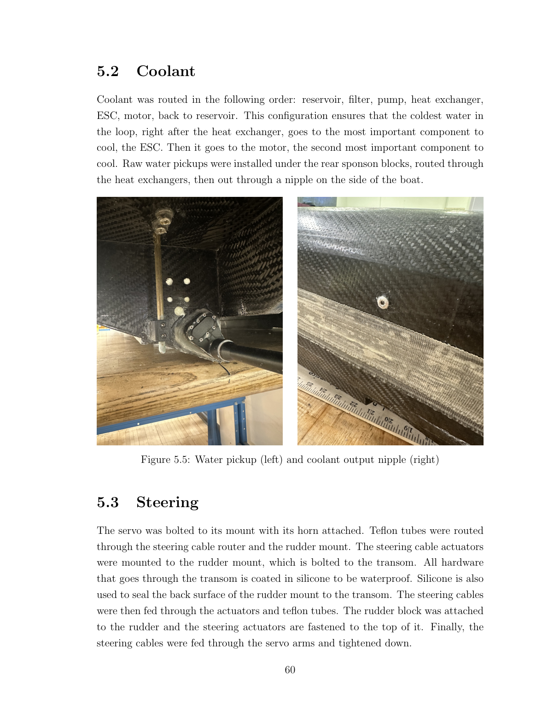
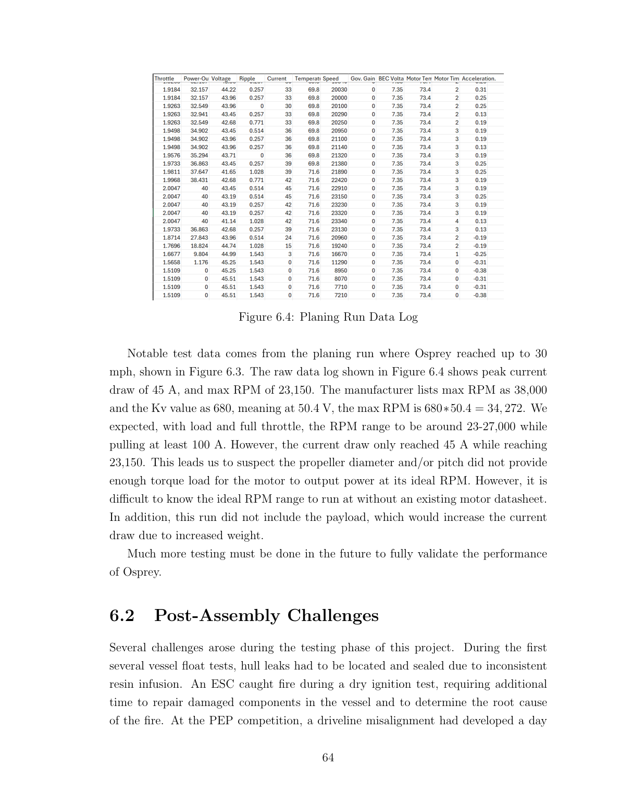

# Osprey — Work Remaining

**Purpose:** scope the next build cycle and seed a presentation.
**Compiled:** September 2026.

**Sources, and how to tell them apart:**
- **[T §x]** — Astudillo & Lee, *"Osprey: High-Speed Electric Unmanned Surface
  Vessel for Payload Transport"*, Princeton MAE senior thesis, 23 April 2026
  (93 pp). Their own findings and recommendations.
- **[SIM]** — the manoeuvring simulation in this repo. See `results/summary.md`.
- **[OPEN]** — not established by either. Needs a decision or a measurement.

> **Timing note.** The thesis targets **PEP26** (14–16 April 2026), which has
> already run. The next cycle is **PEP27**. The rules encoded in
> `params/params_competition.m` are the *2025–2026* Autonomy Division rules —
> **re-download the PEP27 rules before relying on any of them.** Historically
> ASNE changes divisions year to year.

---

## Status in one paragraph

The boat exists, floats, and has planed at 30 mph [T §6.1]. The hull is done and
sound. What stopped it competing properly was not the hull — it was a **driveline
failure that ended the race**, an **ESC failure before it**, and a **cooling
system that never actually worked** [T §6.2, §7.2]. All three are in scope. On
top of that, the boat has no autonomy yet: the simulation, control design and
autopilot parameters exist, but nothing has run on hardware.

**The three things that most constrain the next cycle:**

1. **Driveline reliability** — the flex shaft escaped its collet mid-race and
   the boat had to be towed. Nothing else matters if this repeats.
2. **Powertrain headroom** — the boat drew 45 A when ~100 A was expected, and
   the 80 mph design point looks roughly 4× short on installed power [SIM].
3. **Autonomy from zero** — RC control works; autonomous control has never run
   on the water.

---

# Part 1 — Mechanical

## 1.1 Driveline / driveshaft — **CRITICAL, do this first**

**What happened** [T §6.2]. Two days before the PEP race the boat began
"spinning in a circle despite turning the rudder the other direction." A
physical and audible vibration was traced to one driveline; the shaft collet was
"unbearable to touch with bare skin." Re-seating the motor and collet fixed it
for a day. Then, mid-river, **the flex shaft and propeller escaped the collet and
fell out of the boat**, leaving an open stinger that flooded the stern and
half-submerged the motors.

**Root cause as diagnosed by the previous team:** non-concentricity between the
shaft clutch collet and the flex shaft, caused by **wear of the collet's
cylindrical clamping surface**. The clamping nut had *not* backed out — the
shaft vibrated its way out past the clamping force.

**Why the steering symptom appeared first:** one prop lost RPM, so the boat had
asymmetric thrust it could not trim out. Worth noting for the autonomy work —
**a driveline fault presents as a steering fault**, and any fault-detection logic
should not assume a steering symptom means a steering cause.

### Work items

| # | Item | Notes |
|---|---|---|
| M1 | **Replace both shaft clutch collets** | The failure was wear on the clamping surface. Treat collets as consumables and inspect before every run day. |
| M2 | **Add positive retention** so clamping force is not the only thing holding the shaft | The nut did not loosen — the shaft slipped *through*. Options: a shaft shoulder/step, cross-pin, or a retaining compound. Note Loctite 638 is already used flex-shaft-to-prop-shaft [T §3.3]. **[OPEN]** which method. |
| M3 | **Alignment check + fixture** | Motors sit at a **9.5° down angle** with the stuffing tube bent to guide the shaft [T §3.3]. Alignment is set by the motor plates — build a go/no-go check rather than relying on re-seating by hand. |
| M4 | **Runout inspection procedure** | The collet running hot was the early warning. A documented pre-run check (spin up, feel/IR the collet) would have caught it before the race. |
| M5 | **Consider drive architecture** | The thesis considered flex shaft vs wire drive vs solid shaft, choosing flex for "successful heritage, accessibility" [T §3.3]. Given the failure, worth re-opening. **[OPEN]** |
| M6 | **Stinger sealing / flood protection** | When the shaft left, the open stinger sank the stern. A shaft-loss failure should not be a flooding failure. |

## 1.2 Rudder sizing upgrade

**[SIM]** Full analysis in `results/summary.md` §1–2 and §4d. Headline:

**Size on SPAN, not area.** Rudder authority is the product `A_r · CL_α`.
Growing area at fixed span grows the chord, which collapses aspect ratio and
`CL_α` almost as fast:

| change | AR | CL_α | `A_r·CL_α` |
|---|---|---|---|
| 30× area, span fixed | 0.08 | 0.124 | **1.32×** |
| 3.3× area **via span** | 8.33 | 4.544 | **5.36×** |

**Recommendation: 150–180 mm submerged span at the existing 30 mm chord**
(2.0–2.4× the as-built area), **with the stock balanced at 15–25% chord.**

**Why — and this changed twice, so read the reasoning not just the number.**
On the two-mark oval the boat does not *need* the extra rudder for turning: the
speed loop has thrust margin and powers back through every rounding, so race
time is **402.5 s regardless of rudder size or rounding radius** [SIM]. The
argument is **margin**, not speed:

| rudder | passes ≤5 m track spec | unstable | saturated |
|---|---|---|---|
| as-built 75 mm | 65% | 13% | **41% of the lap** |
| 150 mm | 83% | 8% | **0%** |

Across the plausible hull-parameter range the as-built blade spends 41% of a lap
pinned at its usable deflection limit. It is not short of turning power; it is
short of headroom for disturbance rejection.

**Also implement:** limit servo travel to **±10° (ventilation onset), not ±35°**.
Past onset the blade ventilates and yaw moment *falls* with increasing
deflection (64.4 → 38.7 N·m at 13.4 m/s), latched until it unloads below 6°.
Commanding into that region hands the controller a negative plant gain [SIM].

## 1.3 Stuffing tube manufacturing

The previous team's own note [T §7.2]: bending the brass stuffing tubes was
"trickier than anticipated," kinking is easy and hard to repair, and springback
defeated the jigs. **Their fix, already validated:** anneal in a filament dryer
at **85 °C** while held in the jig. But PLA jigs warp at that temperature —
**print the jigs in ASA** (Tg 95–105 °C vs PLA's 60–65 °C). Alternative: a manual
tube bender.

## 1.4 Hull

Largely done and in good condition [T §7.1] — resin-infused carbon fibre, fully
sealed, "no major issues requiring repairs." Two carry-overs:

- Leaks from inconsistent resin infusion were found and sealed iteratively
  [T §6.2]. Re-float-test after any winter storage.
- A localised repair was made to the hull near the starboard ESC bay [T §6.2].
  Inspect that area for seal integrity.

## 1.5 Mechanical measurements needed — cheap, high value

**[SIM]** These block design decisions and are mostly minutes of work. Full list
with reasoning in `docs/HANDOFF.md` §9.

| # | Measure | Why | Effort |
|---|---|---|---|
| M7 | **Rudder stock chordwise position** | Decides whether the servo spec closes *at all*: 45 kg·cm at the leading edge vs ~0 balanced. If the stock sits *aft* of the centre of pressure the blade is overbalanced and will slam to the stop. | **10 min, callipers** |
| M8 | **Rudder tiller arm radius** | Scales required servo torque **linearly**. Never recorded. | 10 min |
| M9 | **Yaw inertia `Izz`** | Largest single unknown in the model (swept ±50%), likely under-estimated for a catamaran. | 1 h, bifilar pendulum |
| M10 | **Submerged rudder span at planing trim** | Assumed 50% of the blade. This is *the* sizing variable. | 1 run + photo |
| M11 | **CG height above planing surface** | Sets the whole blow-over envelope. | 30 min |
| M12 | **Lateral area above waterline** | Drives crosswind disturbance. | 20 min, CAD |

---

# Part 2 — Electrical

## 2.1 ESC — replacement and specification

**One ESC failed during ground testing and needs replacing** [T §6.2].

**The cause is fully diagnosed, which is the useful part.** ESC data logs showed
**voltage ripple up to 27.767 V — about 60% of pack voltage**, where the limit
for safe operation is **under 10%**. Sustained ripple at that level degrades the
ESC's FETs.

**Root cause: a battery–ESC mismatch.** The original packs were rated **12 C
discharge against the 50 C the ESCs require** [T §6.2]. Discharge rating is a
hard ESC requirement, not a guideline — an underrated pack cannot supply current
fast enough to hold the bus stiff, and the resulting ripple is what does the
damage.

**Already resolved:** switched to **8 × Lectron Pro 22.2 V 5200 mAh 100 C**
packs, 2S-2P per ESC → 44.4 V, 10 400 mAh. Ripple has been at safe levels since,
confirming the diagnosis [T §6.2].

> **Carry-forward rule:** check pack C-rating against the ESC's stated
> requirement on **every** battery change. This was known in the autumn and
> overlooked [T §6.2]. It belongs on a written checklist, not in anyone's head.

### Work items

| # | Item | Notes |
|---|---|---|
| E1 | **Source replacement ESC** | Current: Hydra Cobra 5 HV, 12S, 50.4 V [T §3.2]. **[OPEN]** — same part, or upgrade? |
| E2 | **Decide the current rating**, which depends on the speed target | See §4 below. At the logged 45 A the Cobra 5 is comfortable. If the 80 mph target is retained, **[SIM]** says ~180 A per motor is needed — a completely different ESC class. **This decision gates the ESC spec, the wiring, and the battery.** |
| E3 | **Add ripple monitoring to the pre-run checklist** | The data was in the Castle Link logs all along and was not being read. Cheap insurance. |
| E4 | **Verify pack C-rating against ESC requirement on every battery change** | Root cause of the ESC failure. Make it a checklist line, not tribal knowledge. |
| E5 | **Inspect/replace the second ESC** | It ran through the same high-ripple sessions. FET damage is cumulative. |

## 2.2 High-voltage battery

Architecture is sound and worth preserving [T §3.7.1]: **two fully independent HV
domains**, no shared rail, so a cell failure, ESC fault or phase short in one
cannot propagate to the other. QS8 antispark connectors throughout.

- Current: 8 × Lectron Pro 22.2 V 5200 mAh 100 C, 2S-2P per ESC = 44.4 V nominal
- **PEP limit: ≤ 55.5 V total and < 500 Ah** — 12S at 50.4 V full charge is
  compliant [SIM, rules]
- **[OPEN]** Range/endurance was never characterised. The previous team avoided
  draining packs to 0% and so never established the distance–time–power
  relationship [T §7.1]. **A 2-mile race needs this number.**

## 2.3 Low-voltage (12 V) battery and control system

Current: **GOLDENMATE 12 V 10 Ah LiFePO4**, chosen for its internal BMS
short protection [T §3.7.2]. It powers relay switching, logic, coolant pumps and
the RC receiver. 10 Ah is described as "substantially oversized" for that load.

Distribution: **six-position blade fuse block**, each LV load independently
fused so one fault (stalled pump, shorted wire) blows only its own branch and
leaves relay logic and the kill switch path intact.

### Work items

| # | Item | Notes |
|---|---|---|
| E6 | **Establish why a new 12 V battery is needed** | **[OPEN]** — the thesis reports no LV battery problem. Age, condition, or added autonomy load? The reason determines the replacement spec. |
| E7 | **Re-budget LV load for autonomy** | The autopilot, GPS, telemetry radio and any companion computer are *new* loads the 10 Ah pack was not sized for. Recompute before assuming it is still oversized. |
| E8 | **Add a fused branch for the autopilot** | Keep it on its own fuse, isolated from the pump circuits. |
| E9 | **Autopilot power quality** | Pump motors on the same rail are a noise source. Consider a separate regulator for the flight controller. |

## 2.4 Water cooling — **never actually worked**

**This is the previous team's own headline recommendation** [T §7.2]:

> *"During testing, the raw water pickups never consistently flowed water
> through the heat exchangers, meaning that heat was never consistently removed
> from the ESCs and motors."*

The design is a **closed deionised-water loop** (reservoir → pump → water jacket
→ heat exchanger → reservoir) plus a **raw water pickup** through a **B3-5A
10-plate heat exchanger** [T §3.5]. The raw pickup relies on **hydrodynamic
pressure**, which requires sustained speed — and it did not deliver.

**Why it hasn't bitten yet:** components sat at **40 °C against an 82 °C
manufacturer limit** on a 90 °F day. That margin exists only because the boat
has never been run hard for a sustained period. A 2-mile autonomous race is
exactly that.

### Work items

| # | Item | Notes |
|---|---|---|
| E10 | **Fit pumps on the raw water side** | The thesis's own recommended fix: *"pumps can be installed to pull in raw water instead of worrying about reaching minimum speeds for hydrodynamic pressure"* [T §7.2]. |
| E11 | **Instrument and verify flow** | Not just "the pump runs" — confirm flow *through the heat exchanger*. A flow indicator or ΔT across the exchanger. |
| E12 | **Log temperatures every run** | Castle Link already records ESC and motor temperature [T §6.1]. Make reading it mandatory post-run. |
| E13 | **Sustained-load thermal test** | Full-power run for the race duration, not a short burst. This is the test that was never done. |

## 2.5 Other electrical

- **Remote kill switch**: relay-based with ~5-mile radius; cutting ignition
  stops propulsion immediately [T §3.7.1]. **Verify it still meets the PEP27
  rules** — and see S2 below, which is a *different* requirement.
- **[OPEN]** Wiring and connector sizing were "properly sourced to handle the
  expected continuous current" [T §6.2] — but that was for 45 A. If the current
  target rises (E2), re-derive.

---

# Part 3 — Software / Autonomy / Simulation

## 3.1 What already exists

**[SIM]** A complete 3-DOF manoeuvring simulation and control design, in this
repo. 44 automated checks, all passing. Full detail in `docs/HANDOFF.md`.

- Hull, rudder, propulsion, sensor and actuator models — validated to ~6%
  against the logged 13.4 m/s planing run
- Full control cascade: LOS guidance → heading PID → yaw-rate PI → allocator
- Nomoto system ID, derived gain schedule (**not** grid-searched)
- Monte Carlo robustness, failure modes, full 2-mile course simulation
- **`results/autopilot_params.txt`** — ArduPilot Rover parameters, ready to load

**Never run on hardware.** Every number is conditional on hull coefficients that
are uncertain by ±5×.

## 3.2 Rule 21 — GPS-loss kill (**competition requirement, not implemented**)

The PEP Autonomy rules state:

> *"Teams must demonstrate how the kill switch is engaged when navigation
> information (like GPS data) is missing or corrupted."*

**[SIM]** The simulation shows the boat rides out a 5 s GPS dropout comfortably
(2.42 m cross-track, dead-reckoning on the IMU). **Under the rules that is the
wrong behaviour** — it must *kill*, not coast. Reframed correctly: the
dead-reckoning result is evidence that **triggering the kill is safe**, because
the boat does not lurch when GPS goes away. It is not a reason to coast through.

This is a **demonstrable** requirement — judges watch it. Build it early.

## 3.3 Autonomy stack — the actual work

| # | Item | Notes |
|---|---|---|
| S1 | **Stand up ArduPilot Rover SITL + Mission Planner** | Half a day, needs no hardware and no MATLAB. Most of the flight-code work lives here. `docs/HANDOFF.md` §10 has the full recipe. |
| S2 | **Implement and demo the Rule 21 GPS-loss kill** | §3.2. Competition-gating. |
| S3 | **Decide the control allocation architecture** | **The single biggest software decision.** ArduPilot Rover offers *either* a steering servo plus common throttle, *or* skid steering — **not** the blended rudder-first-then-differential-thrust allocator the simulation uses. That allocator is what gives low-speed control authority and makes a rudder jam survivable below 5 m/s. Reproducing it needs Lua or a custom mixer. **[OPEN]** |
| S4 | **Implement the `1/U²` steering gain schedule** | Rover has **no native gain scheduling**. Options: Lua script, hold a constant cruise speed, or accept ~3× worse low-speed overshoot. Table is in `autopilot_params.txt`. |
| S5 | **Waypoint mission for the two-mark oval** | Marks 0.25 mile apart, ~3.5 laps for 2 miles. See §4 for a number that needs reconciling. |
| S6 | **Steering-fault response mode** | **[SIM]** A jammed rudder is unrecoverable at 8 m/s but fully recoverable at ≤5 m/s — a jammed rudder's moment grows as `u²` while differential thrust is speed-independent, so **slowing down is the recovery action**. Needs a detector (persistent yaw-rate error with unsaturated rudder command) and the authority to cut speed independently of the mission. |
| S7 | **Telemetry logging** | Log everything from the first run. See §3.4. |
| S8 | **Optional: MATLAB model as SITL physics backend** | 1–2 weeks. Puts the real ArduPilot controllers against the real plant. `docs/HANDOFF.md` §10, Level 2. |

## 3.4 What information would most help the simulation

**[SIM]** Ranked by how much uncertainty each collapses per hour spent. Full
programme in `results/summary.md` §7.

| # | Test | Instrumentation | Time | Collapses |
|---|---|---|---|---|
| S9 | **Bifilar pendulum swing** (bench, not water) | stopwatch, two lines | 1 h | **Yaw inertia to ~5%** — kills the ±50% sweep on the largest unknown |
| S10 | **Zig-zag 20°/20° at 3 speeds** | IMU 100 Hz, GPS 5 Hz, rudder feedback | 2 h | `K′` and `T′` — the classic Nomoto ID manoeuvre |
| S11 | **Steady turn circles**, 5/10/15/20° rudder | same + speed log | 2 h | **Ventilation onset angle and depth** — confirms the non-monotonic authority |
| S12 | **Tiller pull test** at 3 speeds | inline load cell on the steering cable | 1 h | **Hinge moment and stock position** — settles the servo spec empirically |
| S13 | **Drift/sideslip run** | GPS COG vs IMU heading | 1 h | `Y_v̇` ⇒ **the Munk moment's magnitude and sign**, currently undetermined |
| S14 | **Coast-down from top speed** | GPS 10 Hz | 0.5 h | Hull resistance curve — only one data point exists today |
| S15 | **Range/endurance run** | current + voltage logging | 2 h | Battery sizing for the 2-mile race [T §7.1 gap] |

**Also now available and not yet used:** the thesis **Appendix A.1** contains the
original **hull sizing MATLAB scripts** (`Hull Sizing Script`, `aeroForce`,
`calcWettedAreaIterative`). The simulation currently uses an independent Savitsky
implementation because these were not available. Worth cross-checking the two.

---

# Part 4 — Cross-cutting: the speed target

**This decision drives the ESC spec, the battery, the wiring and the cooling
load, so it should be made deliberately and early.**

**The evidence:**

- Logged: **30 mph, 45 A peak, 23 150 RPM** [T §6.1]
- Expected by the previous team: **23–27 000 RPM at ≥100 A**. They suspected the
  **propeller was under-pitched/undersized**, not loading the motor enough
  [T §6.1]
- Theoretical max RPM at 50.4 V and 680 Kv: **34 272**
- **[SIM]** Independent of prop assumptions: 35.8 m/s (80 mph) needs ~281 N
  thrust ⇒ ~10.1 kW effective ⇒ **~16 kW electrical** at the 63% chain
  efficiency implied by the team's own log ⇒ **~180 A per motor**. The
  powertrain looks **~4× short** of the 80 mph design point.

**[OPEN] — Decide:**

- **(a) Chase 80 mph.** Requires a different propeller, a much larger ESC, far
  heavier wiring, and a cooling system that genuinely works. Expensive, and
  above ~20 m/s the rudder model is void anyway (cavitation).
- **(b) Optimise for reliably finishing.** **The scoring supports this**:
  **10 points per completed half-mile (40 total) vs 20 for winning outright** —
  finishing is worth **twice** as much as being fastest, and the average speed
  needed to finish inside a 55-minute heat is **0.98 m/s** [SIM, rules].

**Recommendation (b)**, and note that the simulation's conservative choices
already assume it.

**A number to reconcile:** marks 0.25 mile apart put **0.5 mile of straight into
a lap before any turning**, so a lap is **0.54–0.58 mile, not 0.5**. That means
one lap is *not* one half-mile scoring segment, and 2 miles is **~3.5 laps**.
Confirm with ASNE which figure is authoritative before it goes in a white paper.

---

# Summary — work split

| | Mechanical | Electrical | Software / Autonomy |
|---|---|---|---|
| **Critical** | Driveline retention + collets (M1–M2) | ESC replacement + spec (E1–E2) | Rule 21 GPS kill (S2) |
| | Alignment fixture (M3) | Raw-water pumps (E10) | Allocation architecture (S3) |
| **High** | Rudder span upgrade (§1.2) | Sustained thermal test (E13) | SITL + Mission Planner (S1) |
| | Stock position + tiller arm (M7–M8) | LV load re-budget (E7) | Gain schedule (S4) |
| **Medium** | Stinger flood protection (M6) | Ripple monitoring (E3–E4) | Steering-fault mode (S6) |
| | Yaw inertia measurement (M9) | Range/endurance test (E15/S15) | Waypoint mission (S5) |
| **Enabling** | Stuffing tube jigs in ASA (§1.3) | Autopilot power quality (E9) | On-water ID tests (S9–S14) |

**If only three things get done:** driveline retention, working raw-water
cooling, and the Rule 21 kill. The first two are what ended the last campaign;
the third is a gate on competing at all.
